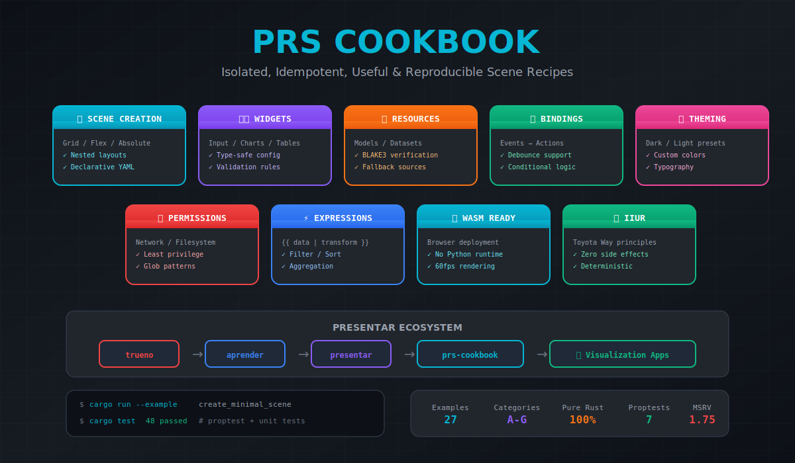

# PRS Cookbook

> Isolated, Idempotent, Useful & Reproducible recipes for the Presentar Scene Format — declarative visualization dashboards in pure Rust

[](https://github.com/paiml/prs-cookbook/actions/workflows/ci.yml)
[](https://opensource.org/licenses/MIT)
[](https://www.rust-lang.org/)
[](QA_CHECKLIST.md)



## Overview

PRS Cookbook provides **27 production-ready recipes** across 7 categories for creating visualization dashboards using the Presentar Scene Format (`.prs`). Each recipe follows **IIUR Principles**: Isolated, Idempotent, Useful, and Reproducible — guided by Toyota Production System quality standards.

### Key Capabilities

- **Declarative Scenes**: YAML-based manifests for UI layouts, widgets, and bindings
- **Type-Safe Parsing**: Full validation with descriptive error messages
- **Zero Runtime**: No Python interpreter required — pure Rust + WASM
- **Resource Management**: Models and datasets with BLAKE3 hash verification
- **Expression Language**: Data transforms with `{{ data | filter | sort }}`

## Installation

Add to your `Cargo.toml`:

```toml
[dependencies]
prs-cookbook = "0.1"
```

With optional features:

```toml
[dependencies]
prs-cookbook = { version = "0.1", features = ["browser", "cli"] }
```

## Quick Start

```rust
use prs_cookbook::prelude::*;

fn main() -> Result<()> {
    // Parse a .prs scene
    let yaml = r#"
prs_version: "1.0"
metadata:
  name: "hello-world"
layout:
  type: flex
  direction: column
widgets:
  - id: greeting
    type: markdown
    config:
      content: "# Hello, Presentar!"
"#;

    let scene = Scene::from_yaml(yaml)?;
    scene.validate()?;

    println!("Scene: {} ({} widgets)",
        scene.metadata.name,
        scene.widgets.len());
    Ok(())
}
```

## Recipe Categories

```
┌─────────────────────────────────────────────────────────────────┐
│                   PRS Cookbook (27 Recipes)                     │
├─────────────────────────────────────────────────────────────────┤
│  A: Scene Creation (5)     │  B: Widget Config (5)              │
│  C: Resources (4)          │  D: Bindings (5)                   │
│  E: Theming (4)            │  F: Permissions (3)                │
│  G: Expressions (5)        │                                    │
├─────────────────────────────────────────────────────────────────┤
│                    presentar (Scene Runtime)                    │
├─────────────────────────────────────────────────────────────────┤
│                    aprender (ML Inference)                      │
├─────────────────────────────────────────────────────────────────┤
│                     trueno (SIMD Compute)                       │
└─────────────────────────────────────────────────────────────────┘
```

### Category Overview

| Category | Recipes | Description |
|----------|---------|-------------|
| **A: Scene Creation** | 5 | Layouts: minimal, grid, flex, absolute, nested |
| **B: Widget Configuration** | 5 | Inputs: textbox, slider, dropdown, charts, tables |
| **C: Model & Dataset Resources** | 4 | Local/remote models, datasets, fallback sources |
| **D: Bindings & Interactions** | 5 | Triggers, debounce, inference, chains, conditionals |
| **E: Theming & Styling** | 4 | Dark/light presets, custom colors, typography |
| **F: Permissions & Security** | 3 | Network, filesystem, minimal privilege |
| **G: Expression Language** | 5 | Select, filter, sort, aggregation, format |

## Examples

```bash
# Category A: Scene Creation
cargo run --example create_minimal_scene
cargo run --example create_grid_layout
cargo run --example create_flex_layout

# Category B: Widget Configuration
cargo run --example widget_text_input
cargo run --example widget_slider
cargo run --example widget_charts

# Category C: Resources
cargo run --example resource_local_model
cargo run --example resource_remote_model

# Category D: Bindings
cargo run --example binding_simple_update
cargo run --example binding_debounced
cargo run --example binding_conditional

# Category E: Theming
cargo run --example theme_preset_dark
cargo run --example theme_custom_colors

# Category F: Permissions
cargo run --example permission_network
cargo run --example permission_minimal

# Category G: Expressions
cargo run --example expression_select
cargo run --example expression_filter
cargo run --example expression_aggregation
```

## PRS Format Structure

```yaml
prs_version: "1.0"

metadata:
  name: "dashboard-app"      # kebab-case identifier
  title: "Sales Dashboard"   # Human-readable title
  author: "Team Name"

resources:
  models:
    sentiment:
      type: apr
      source: "./models/sentiment.apr"
  datasets:
    sales:
      type: parquet
      source: "./data/sales.parquet"

layout:
  type: grid
  columns: 3
  rows: 2
  gap: 16

widgets:
  - id: header
    type: markdown
    position: { row: 0, col: 0, colspan: 3 }
    config:
      content: "# Dashboard"

  - id: chart
    type: bar_chart
    position: { row: 1, col: 0 }
    config:
      title: "Revenue"
      data: "{{ datasets.sales | sum('amount') }}"

bindings:
  - trigger: "filter.change"
    debounce_ms: 300
    actions:
      - target: chart
        action: refresh

theme:
  preset: "dark"

permissions:
  network: []
  filesystem: ["./data/*"]
  clipboard: false
```

## IIUR Principles

Every recipe in this cookbook adheres to Toyota Production System quality standards:

| Principle | Implementation |
|-----------|----------------|
| **Isolated** | Each recipe uses `tempfile::tempdir()` — no shared state |
| **Idempotent** | Same input always produces same output — verified by proptest |
| **Useful** | Solves real visualization problems — copy-paste ready |
| **Reproducible** | Pinned dependencies, cross-platform (Linux, macOS, WASM) |

## Testing

```bash
# Run all tests (48 unit + 7 property-based)
cargo test

# Run with coverage
cargo llvm-cov

# Run clippy
cargo clippy -- -D warnings

# Check formatting
cargo fmt --check
```

## Feature Flags

| Feature | Description |
|---------|-------------|
| `default` | Core parsing and validation |
| `browser` | WASM target support (wasm-bindgen) |
| `cli` | Command-line tools (clap) |
| `presentar` | Full runtime integration |
| `full` | All features enabled |

## Sovereign Stack Integration

PRS Cookbook is part of the Sovereign AI Stack:

```
trueno (SIMD) → aprender (ML) → presentar (Runtime) → prs-cookbook (Recipes)
```

| Component | Purpose |
|-----------|---------|
| [trueno](https://github.com/paiml/trueno) | SIMD-accelerated tensor operations |
| [aprender](https://github.com/paiml/aprender) | ML algorithms and APR format |
| [presentar](https://github.com/paiml/presentar) | Scene rendering runtime |
| **prs-cookbook** | Production-ready visualization recipes |

## Quality Assurance

This repository has been verified against a [134-item QA checklist](QA_CHECKLIST.md):

| Category | Status |
|----------|--------|
| Repository Structure | ✅ 10/10 |
| Cargo Configuration | ✅ 10/10 |
| Core Library | ✅ 30/30 |
| Examples A-G | ✅ 31/31 |
| Tests & Quality | ✅ 27/27 |
| IIUR Compliance | ✅ 10/10 |
| Security | ✅ 6/6 |
| **Total** | **✅ 134/134** |

## License

MIT License — see [LICENSE](LICENSE) for details.

## Contributing

1. Fork the repository
2. Create a recipe following IIUR principles
3. Add tests (unit + proptest)
4. Run `cargo fmt && cargo clippy -- -D warnings && cargo test`
5. Submit a pull request

---

*Built with the Toyota Way: Jidoka (built-in quality), Kaizen (continuous improvement), and Muda elimination (no waste).*
